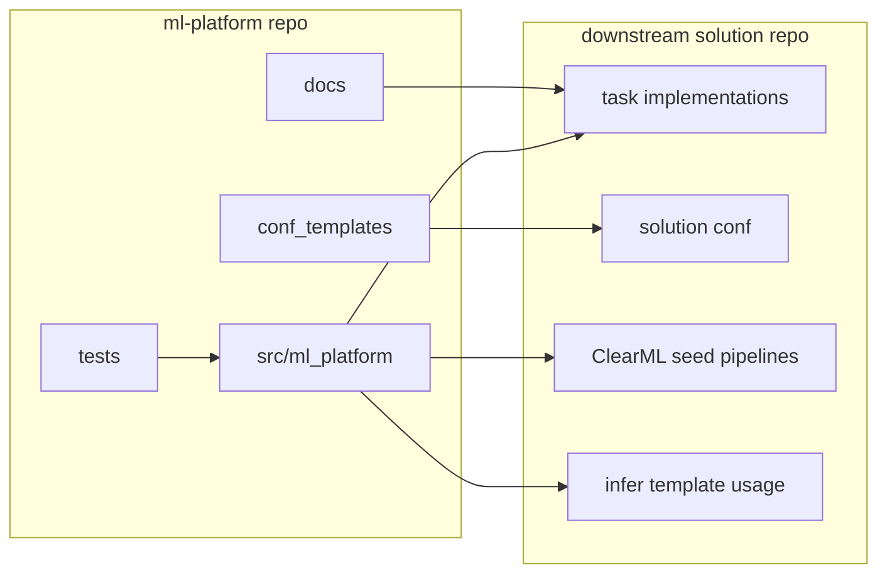

# Setup Guide

このドキュメントは、`ml_platform_v1-master` を次の条件で使い始める人向けの手順書です。

- 新しい Git アカウント上の別 repository に移した
- 新しい PC でセットアップする
- 必要に応じて新しい ClearML サーバーでも最小 smoke をしたい
- platform repo 単体の責務と、solution repo 側でやることの境界を知りたい

この guide の目的は、**platform repo 単体の初期設定と検証を迷わず行い、そのあと downstream solution からこの platform を使える状態にすること**です。

## 1. 先に結論

`ml-platform` は **共通 library / contract repository** です。  
この repo 単体では、業務用の学習 pipeline や infer pipeline を UI から完成運用するわけではありません。

この repo 単体で行うこと:

- package install
- contract / utility test
- 必要なら最小 ClearML smoke
- downstream solution repo から参照できる状態にする

この repo 単体では行わないこと:

- seed pipeline の visible card 運用
- `Pipelines` タブからの `NEW RUN`
- domain 固有の preprocess / train / infer orchestration

それらは **solution repo 側**の責務です。

## 2. 全体像



この repo の正本:

- reusable Python package
  - `src/ml_platform/*`
- config template
  - `conf_templates/*`
- contract documentation
  - `docs/*`
- library verification
  - `tests/*`

## 3. 何が platform 側の責務か

`ml-platform` は主に次を提供します。

- Hydra root config の共通契約
- ClearML integration helper
- task UI hygiene
- config export
- manifest / hashing / versioning
- pipeline utility
- tabular core primitive

代表モジュール:

- `src/ml_platform/config.py`
  - config export, task root defaults
- `src/ml_platform/integrations/clearml/__init__.py`
  - task factory, hparams connect, user properties, artifact upload
- `src/ml_platform/integrations/clearml/pipeline_utils.py`
  - controller helper, parameter handoff, step task id export
- `src/ml_platform/artifacts/*`
  - manifest / hashing
- `src/ml_platform/core/tabular/*`
  - schema, IO, bundle

## 4. 新しい Git repository に移したときの確認事項

### 4.1 platform repo 自体を移しただけの場合

最低限、clone と remote を確認します。

```powershell
git clone <YOUR_NEW_PLATFORM_REPO_URL>
cd ml_platform_v1-master
git remote -v
```

### 4.2 downstream solution 側に影響する点

platform repo の URL が変わると、**この repo を依存に持つ solution repo 側**の更新が必要です。

典型的な更新先:

- `pyproject.toml`
- `requirements/base.txt`
- `uv.lock`

例えば solution repo 側で:

```toml
"ml-platform @ git+https://github.com/<new-account>/<new-ml-platform-repo>@main"
```

へ変更します。

### 4.3 private repository の場合

solution repo の local install だけでなく、**ClearML Agent が remote 実行中に dependency を取得できるか**も重要です。

必要になるもの:

- Git access token / SSH key
- private repo へアクセス可能な agent 環境
- または wheel / package 配布

## 5. 新しい PC でのセットアップ

### 5.1 必須ソフト

- Python 3.10+
- Git
- `uv`

ClearML smoke をしたい場合:

- `clearml.conf` または `CLEARML_*` 環境変数

### 5.2 clone

```powershell
cd D:\
mkdir work
cd work
git clone <YOUR_NEW_PLATFORM_REPO_URL> ml_platform_v1-master
cd ml_platform_v1-master
```

### 5.3 install

標準:

```powershell
uv sync --frozen
```

pip fallback:

```powershell
pip install -r requirements/base.txt
pip install -e .
```

## 6. repo 単体の確認手順

platform repo は standalone app ではないので、まずは **test と import** で確認します。

### 6.1 import smoke

```powershell
py -3 -c "import ml_platform; print('ok')"
```

### 6.2 pytest

```powershell
py -3 -m pytest tests
```

主な確認対象:

- registry
- tabular schema / IO / bundle
- reusable contract helper

### 6.3 config template の確認

この repo は solution repo にコピーして使うための config template を持ちます。

場所:

- `conf_templates/run/base.yaml`
- `conf_templates/data/base.yaml`
- `conf_templates/eval/base.yaml`
- `conf_templates/task/preprocess/base.yaml`
- `conf_templates/task/train/base.yaml`
- `conf_templates/task/infer/base.yaml`
- `conf_templates/task/pipeline/base.yaml`

見るポイント:

- task root が `preprocess`, `train`, `infer`, `pipeline`
- common group が `run`, `seed`, `data`, `eval`

## 7. ClearML 最小 smoke

この repo 単体では visible seed pipeline は作りません。  
ただし、**ClearML connection と platform helper が動くか**は最小 smoke で確認できます。

### 7.1 接続設定

PowerShell:

```powershell
$env:CLEARML_CONFIG_FILE = "D:\path\to\clearml.conf"
```

または:

```powershell
$env:CLEARML_API_HOST = "http://<your-clearml-host>:8008"
$env:CLEARML_WEB_HOST = "http://<your-clearml-host>:8080"
$env:CLEARML_FILES_HOST = "http://<your-clearml-host>:8081"
$env:CLEARML_API_ACCESS_KEY = "<access-key>"
$env:CLEARML_API_SECRET_KEY = "<secret-key>"
```

### 7.2 最小 smoke script

次の例は、platform の `task_factory`, `apply_ui_hygiene`, `report_scalar` が動くかを見るための最小 smoke です。

```powershell
@'
from omegaconf import OmegaConf
from clearml import Task
from ml_platform.integrations.clearml import task_factory, apply_ui_hygiene, report_scalar

cfg = OmegaConf.create({
    "run": {
        "clearml": {
            "enabled": True,
            "project_name": "LAB/ml-platform/smoke",
            "task_name": "platform-smoke",
            "enqueue": False,
        }
    },
    "schema_version": "v1",
})

task = task_factory(cfg, task_type=Task.TaskTypes.testing)
apply_ui_hygiene(
    task,
    cfg,
    hparams={"smoke": {"mode": "platform"}},
    properties={"component": "ml_platform"},
)
report_scalar(task, "smoke", "ok", 1.0)
task.close()
print(task.id)
'@ | py -3 -
```

### 7.3 smoke で確認すること

- task が作成される
- `platform_version`, `code_version`, `schema_version` が user properties に入る
- `config_full.yaml` が artifact に出る
- HyperParameters が接続される

## 8. platform repo 単体でできないこと

誤解しやすい点なので明示します。

この repo 単体では次は行いません。

- `Pipelines` タブ用の seed pipeline sync
- `NEW RUN` ベースの operator 運用
- domain 固有の preprocess / train / infer
- leaderboard からのモデル選択

これらは downstream solution repo の責務です。

## 9. downstream solution でこの platform を使う

最終的に end-to-end の rehearsal をしたい場合は、solution repo がこの platform repo を dependency として参照する必要があります。

### 9.1 Git dependency を使う

solution repo 側:

```toml
"ml-platform @ git+https://github.com/<new-account>/<new-ml-platform-repo>@main"
```

### 9.2 path dependency を使う

ローカルだけで両方を一体運用したいなら、path dependency も選べます。  
ただし current solution 側が Git dependency 前提なら、solution repo 側の install / agent 運用の変更も必要です。

### 9.3 end-to-end rehearsal は solution repo 側

platform repo 単体の smoke が終わったら、solution repo 側で次を行います。

1. `manage_templates --apply`
2. `manage_templates --validate`
3. seed pipeline の `NEW RUN`
4. `99_Leaderboard`
5. `infer` template clone

## 10. 新しい環境での成功条件

### 10.1 platform repo 単体

- install できる
- `pytest tests` が通る
- 必要なら ClearML smoke が通る

### 10.2 downstream solution 連携

- solution repo がこの platform repo を依存として解決できる
- solution 側の template sync が通る
- solution 側の seed pipeline rehearsal が通る

## 11. よくあるハマりどころ

### 11.1 README が空で入口が分からない

この repo ではまず:

- [README.md](d:/tabular_clearml/ml_platform_v1-master/README.md)
- [SETUP.md](d:/tabular_clearml/ml_platform_v1-master/SETUP.md)
- [docs/README.md](d:/tabular_clearml/ml_platform_v1-master/docs/README.md)

を見てください。

### 11.2 platform repo を移したのに solution が古い URL を見ている

solution repo 側の次を確認してください。

- `pyproject.toml`
- `requirements/base.txt`
- `uv.lock`

### 11.3 ClearML smoke は通るが solution の pipeline が動かない

それは platform repo 単体の問題ではなく、solution repo 側の task / config / template sync / queue の問題であることが多いです。

### 11.4 private repo で remote agent が依存取得できない

agent から Git へアクセスできる認証が必要です。  
local install だけ成功していても remote 実行では失敗します。

## 12. 関連ドキュメント

- [README.md](d:/tabular_clearml/ml_platform_v1-master/README.md)
- [docs/README.md](d:/tabular_clearml/ml_platform_v1-master/docs/README.md)
- [docs/00_INVARIANTS.md](d:/tabular_clearml/ml_platform_v1-master/docs/00_INVARIANTS.md)
- [docs/01_POLYREPO_ARCHITECTURE.md](d:/tabular_clearml/ml_platform_v1-master/docs/01_POLYREPO_ARCHITECTURE.md)
- [docs/02_CLEARML_TASK_UI_CONTRACT.md](d:/tabular_clearml/ml_platform_v1-master/docs/02_CLEARML_TASK_UI_CONTRACT.md)
- [docs/03_HYDRA_CONTRACT.md](d:/tabular_clearml/ml_platform_v1-master/docs/03_HYDRA_CONTRACT.md)
- [docs/04_PIPELINE_UTILS.md](d:/tabular_clearml/ml_platform_v1-master/docs/04_PIPELINE_UTILS.md)
- [docs/13_MANIFEST_HASHING_VERSIONING.md](d:/tabular_clearml/ml_platform_v1-master/docs/13_MANIFEST_HASHING_VERSIONING.md)
- [docs/15_CODEMAP.md](d:/tabular_clearml/ml_platform_v1-master/docs/15_CODEMAP.md)
